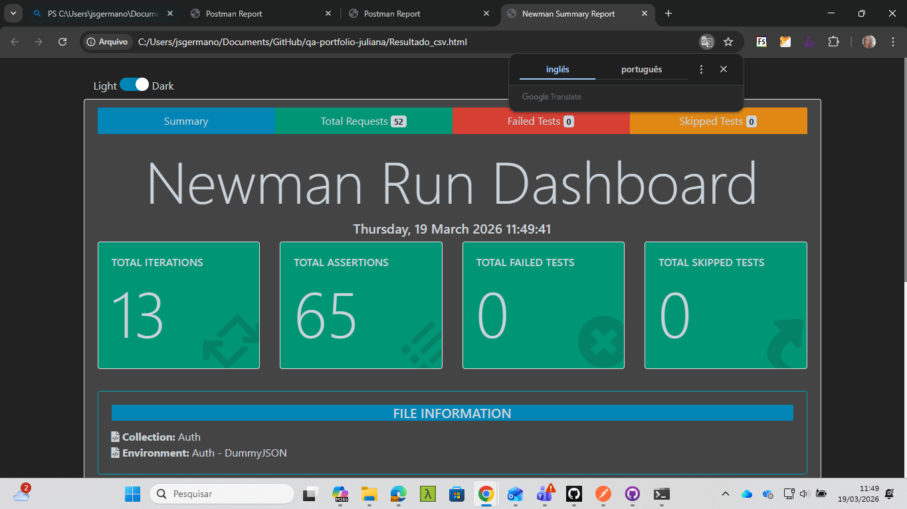

# 🚀 Projeto 4 — API + CSV (Iterações com Newman)


.*

---

## 📁 Estrutura do Projeto

qa-portfolio-juliana/
├─ api-auth-automation/
│  ├─ Auth.postman_collection.json
│  ├─ Auth_DummyJSON.postman_environment.json
│  └─ data/
│     └─ usuarios.csv
└─ api-auth-iterations/
└─ README.md   ← este arquivo

---

## 🧰 Pré‑requisitos

- **Node.js 18+**  
- **Newman** instalado globalmente  
  ```bash
  npm install -g newman
  
Reporters HTML (recomendado):

  npm install -g newman-reporter-html newman-reporter-htmlextra

Massa CSV usada
Arquivo: api-auth-automation/data/usuarios.csv


username,password,expectedStatus,case
emilys,emilyspass,200,login_valido
emilys,wrongpass,401,senha_incorreta
user123,abc123,401,usuario_inexistente
,anypass,400,username_vazio
john.doe, ,400,password_vazio
qa.tester1,wrong,401,senha_errada_random
random.user,random.pass,401,usuario_fake
emilys," emilyspass ",200,login_com_espaco_antes
EMILYS,EMILYPASS,401,case_sensitivity
tester+1@example.com,pass123,401,email_como_username_fake
naoexiste,senha@123,401,usuario_aleatorio
teste,teste,401,credenciais_genericas_invalidas

Body do login no Postman deve ser:

{
  "username": "{{username}}",
  "password": "{{password}}"
}

Script de validação por iteração (Login → Tests)
Adicionar ao final do script existente:

// === Validação da massa CSV ===
const expected = Number(pm.iterationData().get("expectedStatus"));
const got = pm.response.code;

pm.test(`Status esperado (${expected}) vs recebido (${got})`, function () {
    pm.expect(got).to.eql(expected);
});

if (got === 200) {
    let data = pm.response.json();
    pm.test("Resposta 200 contém tokens", function () {
        pm.expect(data).to.have.property("accessToken");
        pm.expect(data).to.have.property("refreshToken");
    });
} else {
    let err = {};
    try { err = pm.response.json(); } catch(e) {}
    pm.test("Resposta de erro possui mensagem", function () {
        pm.expect(err).to.have.property("message");
    });
}

Como rodar (PowerShell)
✔ Execução simples (CLI)

newman run ".\api-auth-automation\Auth.postman_collection.json" `
  -e ".\api-auth-automation\Auth_DummyJSON.postman_environment.json" `
  -r "cli" `
  --iteration-data ".\api-auth-automation\data\usuarios.csv"

  Execução com HTML + JSON
  newman run ".\api-auth-automation\Auth.postman_collection.json" `
  -e ".\api-auth-automation\Auth_DummyJSON.postman_environment.json" `
  -r "cli,html,json" `
  --iteration-data ".\api-auth-automation\data\usuarios.csv" `
  --reporter-html-export "Resultado_csv.html" `
  --reporter-json-export "Resultado_csv.json"

Execução com relatório bonito (htmlextra)

newman run ".\api-auth-automation\Auth.postman_collection.json" `
  -e ".\api-auth-automation\Auth_DummyJSON.postman_environment.json" `
  -r "cli,htmlextra" `
  --iteration-data ".\api-auth-automation\data\usuarios.csv" `
  --reporter-htmlextra-export "Resultado_csv.html"

Abrir relatório:

Start-Process .\Resultado_csv.html

 Exemplo de resultado real

Total Iterations: 13
Requests: 52
Assertions: 65
Failed Tests: 0
Avg. Response Time: ~190ms

(Captura incluída no portfólio na pasta /screenshots – opcional)

Boas práticas aplicadas

Variáveis do CSV no Body ({{username}}, {{password}})
Validação de status esperado por linha
Testes robustos para sucesso e erro
Relatórios HTML e JSON para auditoria
Massas genéricas e seguras
Caminhos relativos compatíveis com CI/CD
Estrutura limpa para portfólio

Integração com Pipeline (opcional)
Adicionar no Azure DevOps:

- powershell: |
    $ts = Get-Date -Format "yyyy-MM-dd_HHmmss"
    newman run "$(Build.SourcesDirectory)/api-auth-automation/Auth.postman_collection.json" `
      -e "$(Build.SourcesDirectory)/api-auth-automation/Auth_DummyJSON.postman_environment.json" `
      -r "cli,htmlextra" `
      --iteration-data "$(Build.SourcesDirectory)/api-auth-automation/data/usuarios.csv" `
      --reporter-htmlextra-export "$(Build.SourcesDirectory)/api-auth-automation/Resultado_csv_$ts.html"
  displayName: 'Executar testes CSV (Newman)'

  Observações finais

Todo conteúdo é genérico e seguro
API usada é pública
Portfólio estruturado para leitura de recrutadores
Arquitetura replicável para qualquer projeto real


---

## 🖼️ Screenshot do Relatório (htmlextra)

Abaixo um exemplo real do relatório gerado durante a execução deste projeto:



> *Este screenshot mostra exatamente como o relatório é exibido com o `newman-reporter-htmlextra`:*
> - tema claro/escuro
> - cartões de estatísticas (iterações, asserts, falhas)
> - time metrics (mín, máx, média)
> - detalhes de cada request
> - navegação por abas (Summary, Requests, Failed, Skipped)

---

## 📊 Interpretação do Relatório

O relatório do **htmlextra** é dividido em seções importantes para análise rápida:

### 🔹 **Summary**
Mostra um panorama geral:
- Iterações executadas  
- Total de requisições  
- Total de asserts  
- Falhas (se houver)  
- Tempo médio de resposta  

### 🔹 **Requests**
Exibe cada chamada HTTP e inclui:
- URL  
- Método  
- Corpo enviado  
- Status retornado  
- Headers  
- Response body  

### 🔹 **Test Results**
Lista todos os testes:
- asserts que passaram ou falharam  
- scripts relacionados  
- logs e mensagens do Postman  

### 🔹 **Response Times**
Gráficos mostrando:
- mínimo  
- máximo  
- média  
- desvio padrão  

### 🔹 **Exportações**
Além do HTML, este projeto gera:
- `Resultado_csv.html` (visual)  
- `Resultado_csv.json` (auditoria completa)

---

## 🏁 Resultado Final

A execução deste projeto com a massa CSV resultou em:

- **Total Iterations:** 13  
- **Total Requests:** 52  
- **Assertions:** 65  
- **Failed Tests:** 0  
- **Tempo médio:** ~190 ms  

Esses números confirmam:
- a collection está consistente  
- os scripts de validação funcionam  
- a massa CSV está bem definida  
- o fluxo contínuo de autenticação (login → erro → combinações) opera corretamente

---

## 🧩 Benefícios deste Projeto

- Demonstra domínio de **testes orientados a dados (DDT)**  
- Útil para validar diversos cenários sem alterar a collection  
- Pronto para CI/CD (Pipeline do Projeto 3)  
- Cria evidências profissionais (HTML/JSON)  
- Visual forte para portfólio  
- API pública = zero risco de compliance  
- Fácil de replicar em qualquer empresa

---

## 🏆 Conclusão

Este projeto comprova habilidade em:
- **Automação de API**
- **Testes orientados a dados (CSV)**
- **Newman CLI**
- **Relatórios HTML avançados**
- **Validações dinâmicas com Postman Scripts**
- **Organização profissional de portfólio**

Ele se integra naturalmente com:
- Projeto 1 (Collection de API)  
- Projeto 2 (Processos de QA)  
- Projeto 3 (Pipeline CI/CD)

Feito com 💛 por Juliana
